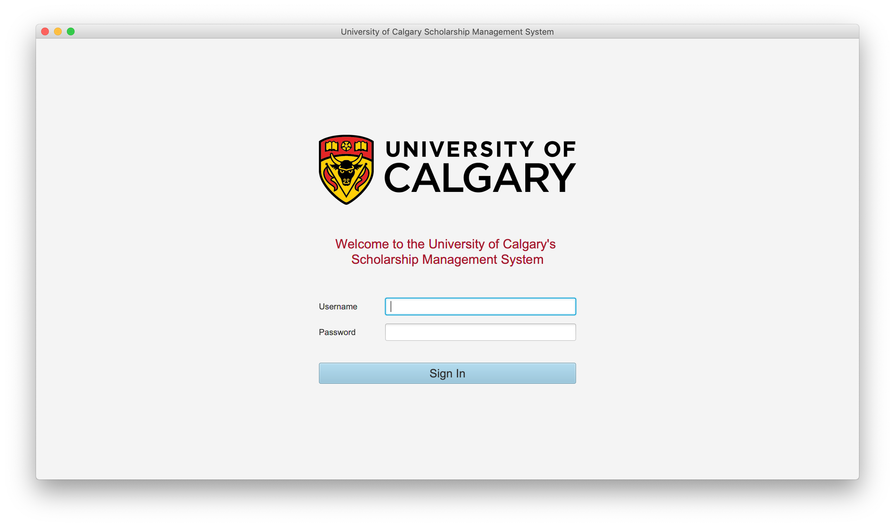
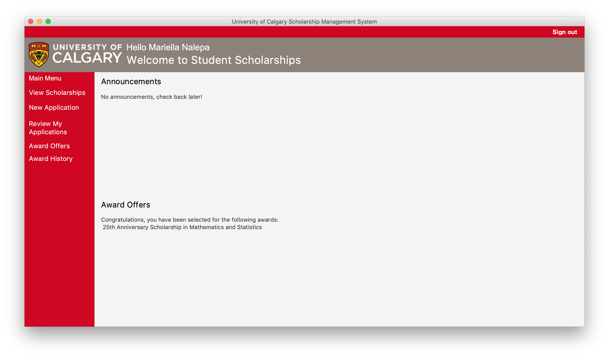
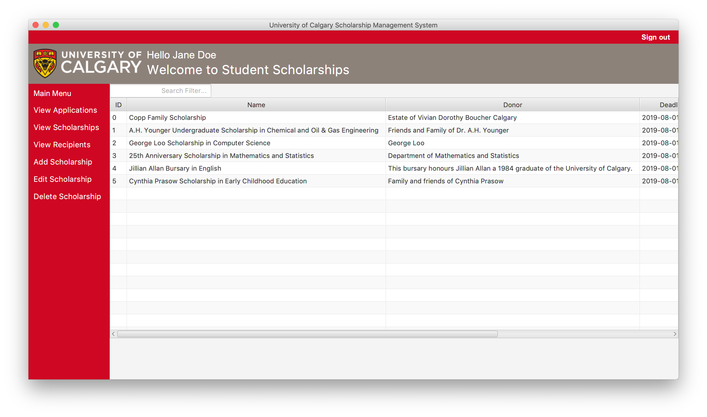
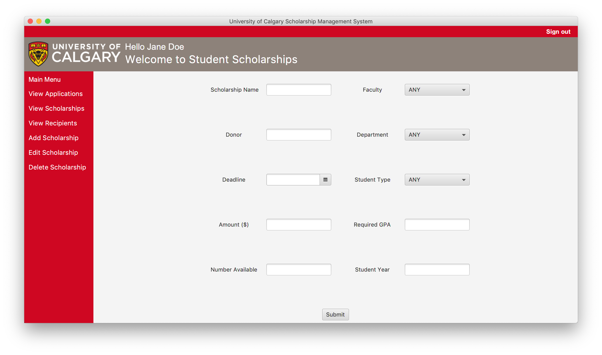

# Student Scholarship System
## Intro to Software Engineering Project

Five-member group project completed for an introductory software engineering course to explore software development methodologies from design through to testing; as such, the project focussed more on process rather than product. 

A desktop application for the hypothetical management of student scholarships was developed using JavaFX and FXML, an XML-based language provided by JavaFX for building UIs independent of the application logic. The application architecture follows the MVC (Model-View-Controller) pattern. 

While the assigned project was contrived and a true database was not expected to be implemented in backend due to the varying experience and knowledge of project members, it was a valuable experience for version-controlled parallel development, team self-organization, code refactoring, and even understanding and application of architectural patterns. 

Original repo on university's GitLab server. 

  
  
  
  

To run:
Load the project into Eclipse
Run as a Java Application (from Main.java)

Authentication information required to "login":

Student Users:  
  user -> password  
  natalie.dean -> apple  
  jasmine.roebuck -> banana  
  luc.legere -> orange  
  mariella.nalepa -> pear  
  david.roberts -> grape  
  
Admin User:  
  jane.doe -> poodle  
  
  

